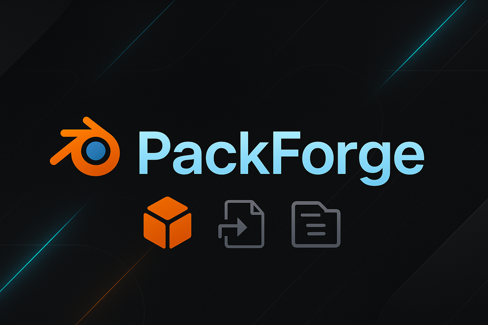

Addon para empaquetado automático de assets en Blender.
# Contenido profesional del nuevo README.md con el banner incluido
readme_content = """

  

# 🧰 PackForge

**Empaquetador automático de assets para Blender.**  
PackForge te permite exportar assets listos para compartir, incluyendo miniaturas, documentación, texturas y múltiples formatos de archivo, todo desde una interfaz integrada en Blender.

---

## 🚀 Características principales

- 📦 Empaquetado automático de assets en una estructura profesional.
- 🎨 Generación de thumbnails con cámara y luz preconfigurada.
- 🧾 Creación de documentación `.txt` o `.pdf` con versión de Blender y licencias.
- 💾 Exportación en múltiples formatos: `.blend`, `.fbx`, `.obj`, `.glb/.gltf`.
- ⚙️ Panel en `N > PackForge` con controles personalizados.
- 🧩 Compatible con Blender 4.1+.
- 🖼️ Icono e identidad visual personalizada.

---
## 🧪 Cómo instalar

1. Descargá el ZIP desde la sección **Releases**.
2. En Blender, andá a `Edit > Preferences > Add-ons > Install`.
3. Seleccioná el archivo `PackForge_v2.zip` y activá el addon.

---

## 📤 Cómo usar

1. Seleccioná los objetos a empaquetar.
2. Abrí el panel `N > PackForge`.
3. Configurá las opciones que quieras exportar.
4. Presioná **"Empaquetar Assets"** y listo.

---

## 📘 Licencia

Este addon se distribuye bajo licencia [MIT](LICENSE).

---

## ✨ Créditos

Creado por Luis con ayuda de IA 🤖 y mucha pasión por Blender.

"""

# Ruta para guardar el nuevo README.md
readme_path = "/mnt/data/PackForge_v2/README.md"

# Guardar el archivo actualizado
with open(readme_path, "w", encoding="utf-8") as f:
    f.write(readme_content)

readme_path
